# 👋 Olá, eu sou André Dias

## 🚀 Sobre Mim

**Technical Architecture Director @ Avanade | Cloud, DevOps & Platform Engineering | 11x Microsoft MVP**

Executivo de tecnologia com mais de 25 anos de experiência em arquitetura de software, cloud computing, DevOps e transformação digital, atuando na liderança de iniciativas estratégicas para grandes bancos, empresas globais, governo e consultorias internacionais. Reconhecido globalmente como **Microsoft Most Valuable Professional** por 11 anos consecutivos, com forte atuação na construção de plataformas escaláveis, times de alta performance e entregas de alto impacto para o negócio.

Atuo na **interseção entre estratégia, arquitetura e execução**, ajudando organizações a modernizar seus ambientes, acelerar a entrega de valor e operar cloud em escala com segurança, governança e eficiência.

### 🎯 Principais Áreas de Atuação

- Arquitetura de soluções em Azure, AWS e Google Cloud
- DevOps, CI/CD, Platform Engineering e Infrastructure as Code
- Modernização de aplicações e microservices
- Cloud Governance, Security, FinOps e Observabilidade
- Liderança técnica executiva, recovery de projetos críticos
- Atuação forte em Financial Services, Governo, Seguros e Indústria

### 💡 Perfil

Apaixonado por tecnologia, pessoas e resultados. Experiência comprovada em liderar times, escalar plataformas, resolver problemas complexos e conectar tecnologia à estratégia de negócio.

## 🌟 Premiações e Reconhecimento

### Microsoft Most Valuable Professional (MVP) - 11 Anos Consecutivos

<table>
<tr>
<td rowspan="2" align="center" valign="middle">
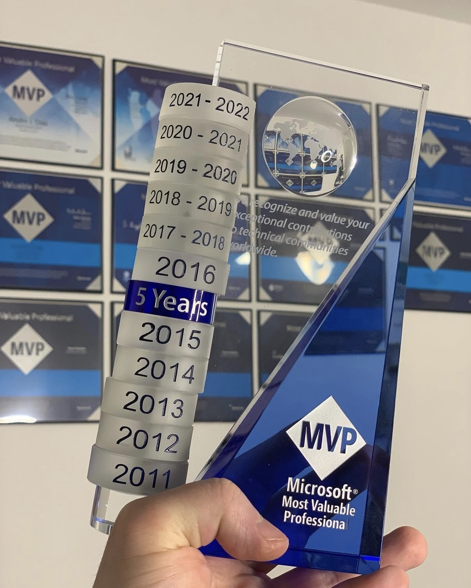
</td>
<td align="center">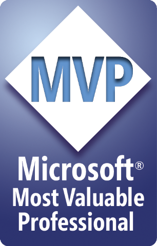 <b>2011</b></td>
<td align="center"> <b>2012</b></td>
<td align="center"> <b>2013</b></td>
<td align="center"> <b>2014</b></td>
<td align="center"> <b>2015</b></td>
<td align="center"> <b>2016</b></td>
</tr>
<tr>
<td align="center">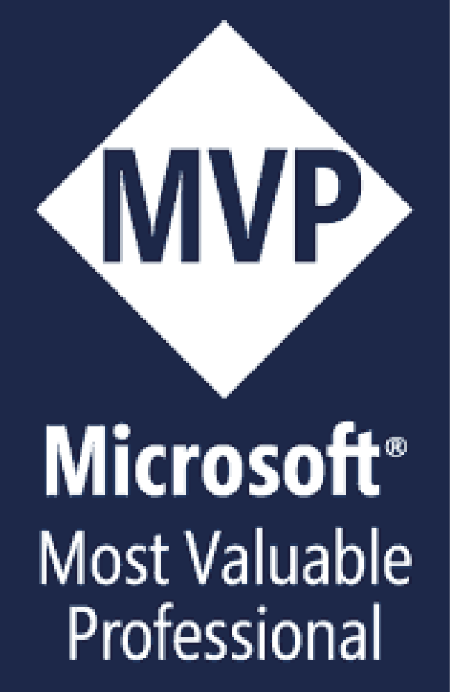 <b>2017-2018</b></td>
<td align="center"> <b>2018-2019</b></td>
<td align="center">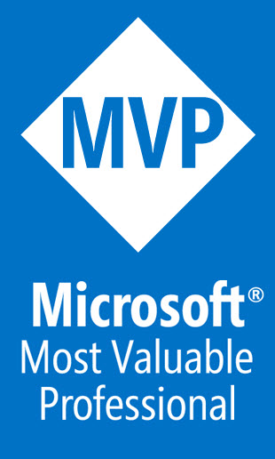 <b>2019-2020</b></td>
<td align="center"> <b>2020-2021</b></td>
<td align="center"> <b>2021-2022</b></td>
<td align="center"></td>
</tr>
</table>

---

### 🏆 GitHub Partner Award 2025
**GSI Services and Channel Partner of the Year** | Accenture & Avanade

  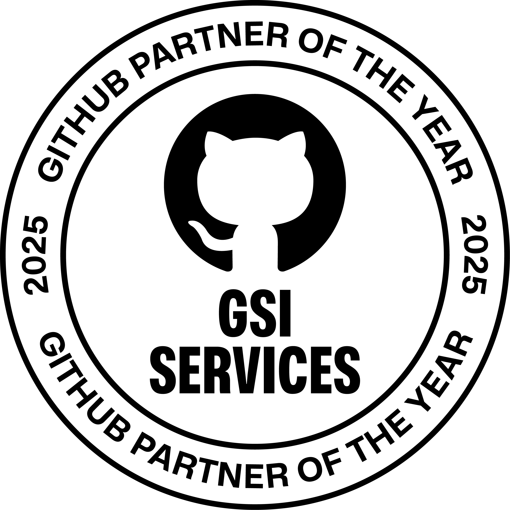

Em outubro de 2025, tive a honra de representar a Avanade & Accenture na premiação de **Partner of the Year** do GitHub em San Francisco, onde recebemos o prêmio de melhor parceiro do mundo na principal categoria da competição devido às contribuições significativas para inovação, segurança e adoção de IA nos projetos de nossos clientes.

  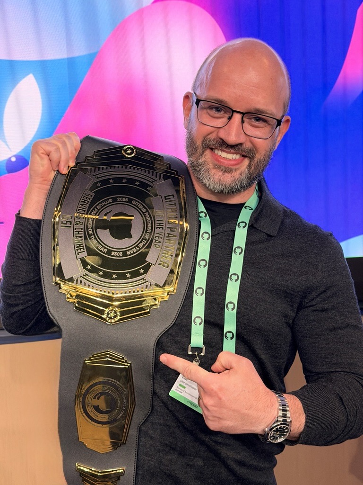
  
  

**Saiba mais:** [GitHub Partner Awards 2025](https://github.blog/news-insights/company-news/announcing-the-2025-github-partner-award-winners/)

## 🏆 Certificações

### ☁️ Cloud Platforms

#### Microsoft Azure

  
  
  
  
  
  
  
  

- **Azure Solutions Architect Expert**
- **DevOps Engineer Expert**
- **Azure Developer Associate**
- **Azure Administrator Associate**
- **Azure Security Engineer Associate**
- Azure AI Fundamentals
- Azure Data Fundamentals
- Azure Fundamentals

#### Amazon Web Services (AWS)

  
  
  

- **AWS Certified Solutions Architect – Associate**
- **AWS Certified SysOps Administrator – Associate**
- AWS Certified Cloud Practitioner

#### Google Cloud Platform (GCP)

  
  

- **Google Cloud Certified - Professional Cloud Architect**
- **Google Cloud Certified - Associate Cloud Engineer**

### 🔧 DevOps & Tools

#### GitHub

  
  
  
  
  
  
  
  
  
  
  
  
  

- **GitHub Administration**
- **GitHub Advanced Security**
- **GitHub Actions**
- **GitHub Copilot**
- **GitHub Foundations**
- GitHub Migrations Partner Delivery Credential
- AzureDevOps to GitHub Migrations Delivery Credential
- GitHub Tech Sales Professional
- GitHub Sales Professional
- FY26 GitHub Platform Sales Badge
- FY26 GitHub Advanced Security Sales Badge
- FY26 GitHub Copilot Sales Badge
- FY26 GitHub Revenue Motions Sales Badge

#### HashiCorp

  

- Terraform Associate (002)

#### Microsoft Cloud, DevOps & Application Lifecycle Management (ALM) Legacy Certifications

  
  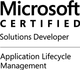
  
    
  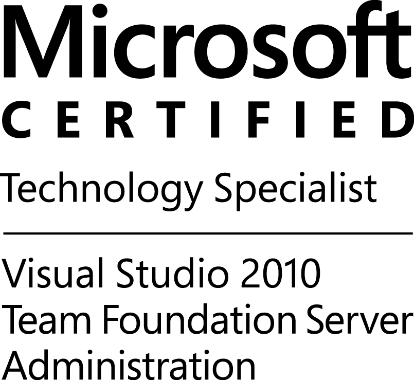
  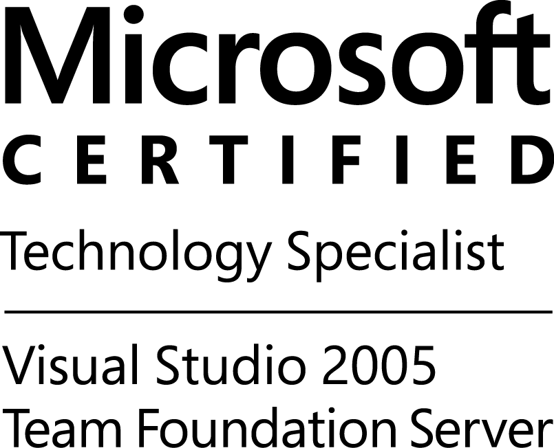

- **Microsoft Certified Solutions Developer: Application Lifecycle Management**
- **Microsoft Certified Solutions Developer: Azure Solutions Architect**
- **Microsoft Certified Solutions Expert: Cloud Platform and Infrastructure**
- 498: Delivering Continuous Value with Visual Studio ALM
- 497: Software Testing with Visual Studio
- 496: Administering Visual Studio Team Foundation Server
- 512: Visual Studio Team Foundation Server 2010, Administration
- 510: Microsoft Team Foundation Server - Configuration and Development

### 📚 Metodologias Ágeis

  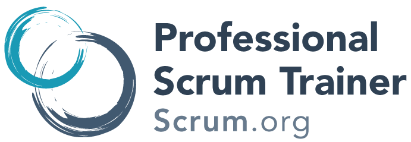
  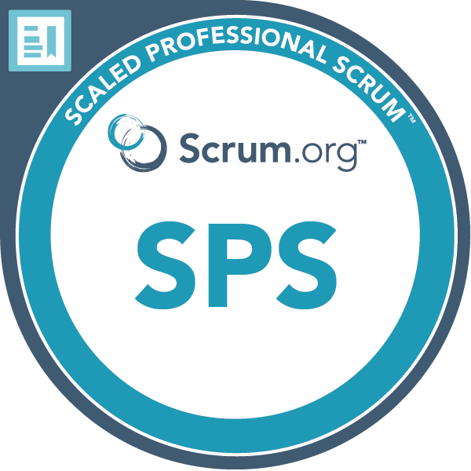
  
  
  

- **Professional Scrum Trainer (PST)**
- **Scaled Professional Scrum™ (SPS)**
- Professional Scrum Master™ I (PSM I)
- Professional Scrum Developer™ I (PSD I)
- Certified Scrum Master (CSM)

### 💻 Desenvolvimento de Software (Legacy)

  
  
  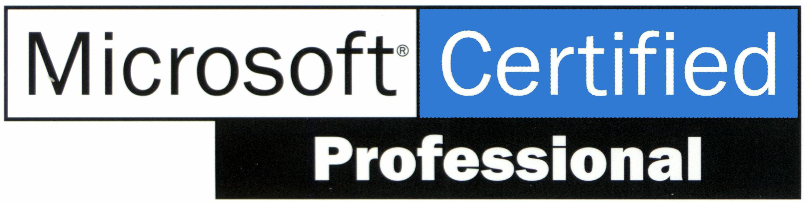

- Sun Certified Java Programmer
- Sun Certified Web Component Developer
- 536: TS: Microsoft .NET Framework - Application Development Foundation
- 315: Developing and Implementing Web Applications with Microsoft Visual C#™ .NET and Microsoft Visual Studio .NET
- 316: Developing and Implementing Windows-based Applications with Microsoft Visual C#™ .NET and Microsoft Visual Studio .NET
- 176: Designing and Implementing Desktop Applications with Microsoft Visual Basic 6.0

### 🌱 Sustentabilidade

  

- LFC131: Green Software for Practitioners (Linux Foundation)

## 🎓 Formação Acadêmica

- **Bacharel em Ciência da Computação**

## 💼 Destaques da Experiência

### Senior Manager / Director  – Accenture / Avanade (2020 - Presente)
Liderança de programas estratégicos de cloud e arquitetura para grandes instituições financeiras, incluindo migrações em larga escala, definição de landing zones, padrões corporativos de segurança, identidade, conectividade e DevOps.

### Principal / Enterprise Architect – CI&T | GFT Technologies (2018 - 2020)
Atuação em projetos críticos no mercado financeiro e de capital markets, com foco em modernização arquitetural, automação, cloud e turnaround de contratos em risco.
- Arquitetura de infraestrutura e pipelines DevOps para e-commerce B2B da AB-InBev
- Migração e automação multicloud para instituições financeiras

### COO / CTO – ESX (2015 - 2018)
Responsável pela transformação da empresa em referência nacional em Cloud, DevOps e AI, liderando crescimento acelerado, inovação, aumento significativo de margem operacional e criação de novos produtos digitais.

### Consultor – Microsoft Brasil (2008 - 2010)
Atuação em projetos estratégicos de grande relevância nacional, incluindo Internet Banking, DevOps no setor público e governo, além de contribuição ativa para comunidades técnicas.

## 🥋 Além do Código: Jiu-Jitsu

<table>
<tr>
<td width="30%">
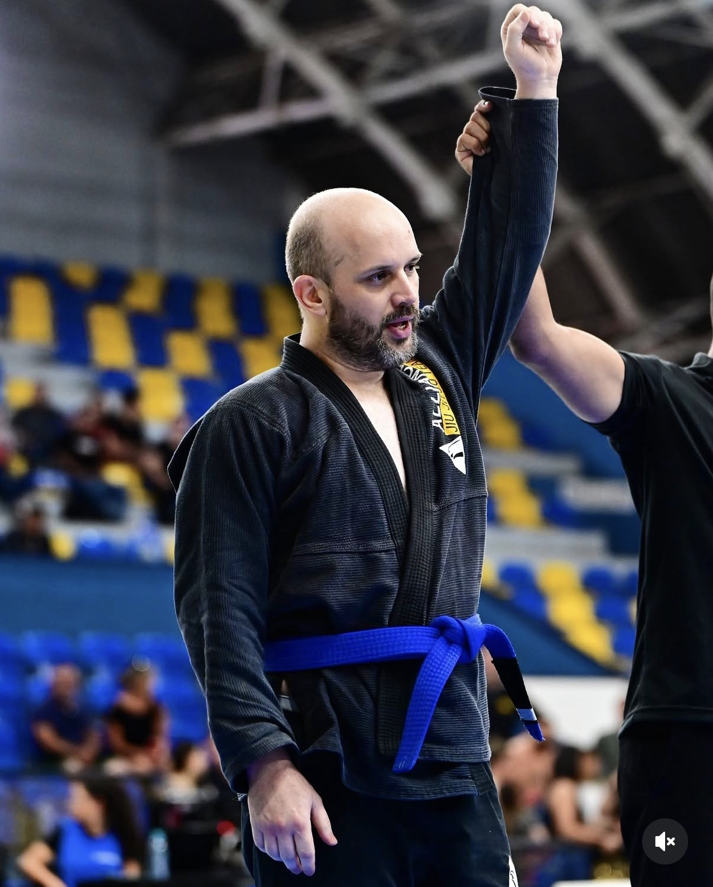
</td>
<td width="70%">

Praticante e faixa azul de **Jiu-Jitsu**, levo muitos dos ensinamentos do tatame para o dia a dia profissional e vice-versa. A disciplina, resiliência e capacidade de trabalhar sob pressão que desenvolvo no tatame se refletem diretamente na forma como abordo desafios técnicos e lidero equipes.

Assim como no Jiu-Jitsu, onde cada posição exige estratégia e adaptação constante, a arquitetura de software e a liderança técnica demandam planejamento, persistência e a habilidade de transformar situações adversas em oportunidades de crescimento.

</td>
</tr>
</table>

## 📫 Como me encontrar

- 💼 LinkedIn: [andrediasbr](https://www.linkedin.com/in/andrediasbr/)
- 🏆 Credly: [andredias](https://www.credly.com/users/andredias/badges)
- 🐱 GitHub: [andrediasbr](https://github.com/andrediasbr)
- 📺 YouTube: [andrediasbr](https://www.youtube.com/andrediasbr)
- 📷 Instagram: [andrediasbr](https://instagram.com/andrediasbr)
- 🐦 Twitter: [andrediasbr](https://twitter.com/andrediasbr)

