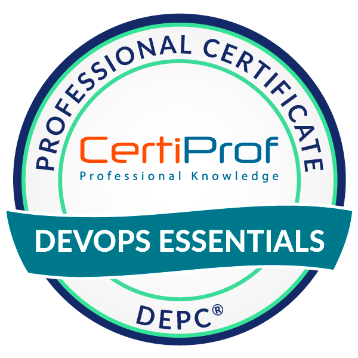
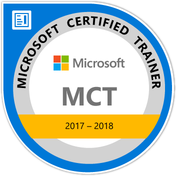
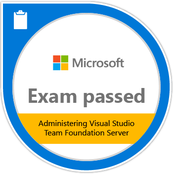

# 👋 Olá, eu sou André Dias

## 🚀 Sobre Mim

**Technical Architecture Director @ Avanade** | 11x Microsoft MVP | 60+ Certificações | Cloud Solutions Architect

Líder técnico com 25+ anos de experiência em transformação digital, desde startups até multinacionais como Microsoft (Brasil e Europa), Accenture, e Avanade. Especializado em arquiteturas multicloud (Azure, AWS, GCP) e práticas DevOps em escala enterprise.

Reconhecido com o **GitHub Partner Award 2025** (GSI Services Partner of the Year) e premiado por 11 anos consecutivos (2011-2022) como **Microsoft MVP em DevOps**. Professional Scrum Trainer certificado pela Scrum.org e ex-membro do Microsoft ALM Rangers.

Ao longo da carreira, atuei em projetos estratégicos para organizações como Bradesco (migração de 30.000+ repositórios GitHub Enterprise), AB-InBev (arquiteturas de referência GCP), Santander, Zurich, Banco ABC e governo, combinando visão estratégica com excelência técnica em Cloud, DevOps e Agile.

📍 Piracicaba, São Paulo, Brasil

## 💼 Destaques da Experiência

### Technical Architecture Director @ Avanade
**Maio 2024 - Presente** | São Paulo, Brasil

**Bradesco - Transformação Digital em Escala:**
- Liderança na migração de 30.000+ repositórios para GitHub Enterprise
- Redução do tempo de deploy de APIs de 15 dias para 10 minutos através de automação DevOps
- Capacitação de 4.000+ desenvolvedores em práticas modernas de desenvolvimento
- Implementação de governança técnica para 75% das transações migradas para cloud

### Experiência Anterior
- **Accenture Brasil** - Cloud Enterprise Architect Senior Manager (2020-2022)
  - Chapter Lead DevOps/SRE para AB-InBev, criação de arquiteturas de referência em GCP
  - Projetos estratégicos para Santander, Zurich, Banco ABC em cloud multi-vendor
- **CI&T** - Principal Architect (2020)
  - Arquitetura de infraestrutura e pipelines DevOps para e-commerce B2B da AB-InBev
- **GFT Group** - Senior DevOps & Cloud Architect (2018-2019)
  - Migração e automação multicloud para instituições financeiras
- **Microsoft** - ALM Consultant (2008-2010)
  - Projetos ALM para bancos e governo, migração de plataformas críticas

## 🌟 Premiações e Reconhecimento

### 🏆 GitHub Partner Award 2025
**GSI Services and Channel Partner of the Year** | Accenture & Avanade

  

Em outubro de 2025, a Accenture e Avanade foram reconhecidas pelo GitHub como **Global Systems Integrator (GSI) Services and Channel Partner of the Year**, destacando-se pela excelência em entregar valor excepcional, impacto transformador e fortalecer a missão compartilhada de inovação e colaboração no ecossistema de desenvolvedores.

> "Partners are a force multiplier for GitHub. Partners amplify our capabilities, expand our reach, and accelerate innovation for our joint customers."  
> — *Elizabeth Pemmerl, Microsoft CVP and GitHub Chief Revenue Officer*

  
  
  

Este prêmio reconhece a contribuição significativa em capacitar clientes a desbloquear inovação, fortalecer segurança e construir soluções únicas que integram o GitHub às necessidades específicas de cada organização.

**Saiba mais:** [GitHub Partner Awards 2025](https://github.blog/news-insights/company-news/announcing-the-2025-github-partner-award-winners/)

---

### Microsoft Most Valuable Professional (MVP) Alumni - 11 Anos Consecutivos

  

**11x Microsoft Most Valuable Professional (MVP)** | 2011 - 2022

<table>
<tr>
<td align="center"> <b>2011-2012</b></td>
<td align="center"> <b>2012-2013</b></td>
<td align="center"> <b>2013-2014</b></td>
<td align="center"> <b>2014-2015</b></td>
<td align="center"> <b>2015-2016</b></td>
<td align="center"> <b>2016-2017</b></td>
</tr>
<tr>
<td align="center"> <b>2017-2018</b></td>
<td align="center"> <b>2018-2019</b></td>
<td align="center"> <b>2019-2020</b></td>
<td align="center"> <b>2020-2021</b></td>
<td align="center"> <b>2021-2022</b></td>
<td align="center"></td>
</tr>
</table>

---

## 🏆 Certificações

### ☁️ Cloud Platforms

#### Microsoft Azure

  
  
  
  
  
  
  

- **Azure Solutions Architect Expert** (Exp: Dec 2026)
- **DevOps Engineer Expert** (Exp: Oct 2026)
- **Azure Developer Associate** (Exp: Jan 2027)
- **Azure Administrator Associate** (Exp: Oct 2026)
- **Azure Security Engineer Associate** (Exp: May 2026)
- Azure AI Fundamentals
- Azure Data Fundamentals
- Azure Fundamentals

#### Amazon Web Services (AWS)

  
  
  
  

- **AWS Certified Solutions Architect – Associate**
- **AWS Certified SysOps Administrator – Associate**
- AWS Certified Cloud Practitioner
- Well-Architected Proficient

#### Google Cloud Platform (GCP)

  
  

- **Professional Cloud Architect**
- **Associate Cloud Engineer**

### 🔧 DevOps & Tools

#### GitHub

  
  
  
  
  
  
  
  
  
  
  

- **GitHub Administration**
- **GitHub Advanced Security**
- **GitHub Actions**
- **GitHub Copilot**
- **GitHub Foundations**
- GitHub Tech Sales Professional
- GitHub Sales Professional
- FY26 GitHub Platform Sales Badge
- FY26 GitHub Advanced Security Sales Badge
- FY26 GitHub Copilot Sales Badge
- FY26 GitHub Revenue Motions Sales Badge

#### HashiCorp

  

- Terraform Associate (002)

### 📚 Metodologias Ágeis

  
  
  
  
  

- **Scaled Professional Scrum™ (SPS)**
- **Professional Scrum Master™ I (PSM I)**
- **Professional Scrum Developer™ I (PSD I)**
- Scrum Foundation Professional (SFPC)
- DevOps Essentials Professional (DEPC)

### 🎓 Microsoft Certified Trainer

  
  
  
  

- MCT 2017-2018
- MCT 2020-2021
- MCT 2021-2022
- MCT 2022-2023

### 📝 Microsoft Exams

  
  
  
  
  
  
  
  

**Azure & Cloud Exams:**
- AI-900: Microsoft Azure AI Fundamentals (2024)
- DP-900: Microsoft Azure Data Fundamentals (2021)
- AZ-900: Microsoft Azure Fundamentals (2021)
- AZ-500: Microsoft Azure Security Technologies (2020)
- AZ-400: Designing and Implementing Microsoft DevOps Solutions (2018)
- AZ-302: Microsoft Azure Solutions Architect Certification Transition (2018)
- AZ-203: Developing Solutions for Microsoft Azure (2020)
- AZ-102: Microsoft Azure Administrator Certification Transition (2019)
- 535: Architecting Microsoft Azure Solutions (2018)
- 534: Architecting Microsoft Azure Solutions (2017)
- 533: Implementing Microsoft Azure Infrastructure Solutions (2016)
- 532: Developing Microsoft Azure Solutions (2017)

**Application Lifecycle Management (ALM):**
- 512: Visual Studio Team Foundation Server 2010, Administration (2011)
- 510: Microsoft Team Foundation Server - Configuration and Development (2009)
- 498: Delivering Continuous Value with Visual Studio ALM (2012)
- 497: Software Testing with Visual Studio (2012)
- 496: Administering Visual Studio Team Foundation Server (2012)

### 🏅 Microsoft Legacy Certifications

  
  
  

- MCSE: Cloud Platform and Infrastructure (2018)
- MCSD: Azure Solutions Architect (2017)
- MCSD: Application Lifecycle Management (2012)
- MCSA: Cloud Platform Charter Member (2017)
- Microsoft Specialist: Architecting Microsoft Azure Solutions
- Microsoft Specialist: Developing Microsoft Azure Solutions
- Microsoft Specialist: Implementing Microsoft Azure Infrastructure Solutions
- Microsoft Certified Professional
- MCSE: Cloud Platform and Infrastructure 2017
- MCSE: Cloud Platform and Infrastructure 2018

### 🌱 Sustentabilidade

  

- LFC131: Green Software for Practitioners (Linux Foundation)

## 🛠️ Tecnologias & Ferramentas

## � Publicações

- **Team Foundation Build Customization Guide** - Guia de personalização de builds
- **MVA Fundamentos de DevOps** - Microsoft Virtual Academy
- **MVA Administering Visual Studio Team Foundation Server 2012** - Curso preparatório para exame 70-496
- **Build Usage Extension** - Extensão para Azure DevOps

## 📫 Como me encontrar

-  LinkedIn: [andrediasbr](https://www.linkedin.com/in/andrediasbr/)
- 🏆 Credly: [andredias](https://www.credly.com/users/andredias/badges)
- 🐱 GitHub: [@andrediasbr](https://github.com/andrediasbr)

---

⭐️ From [@andrediasbr](https://github.com/andrediasbr)
